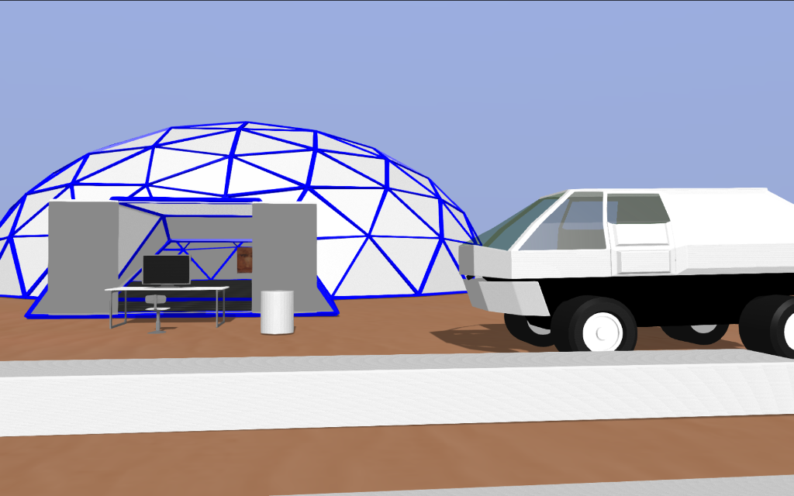
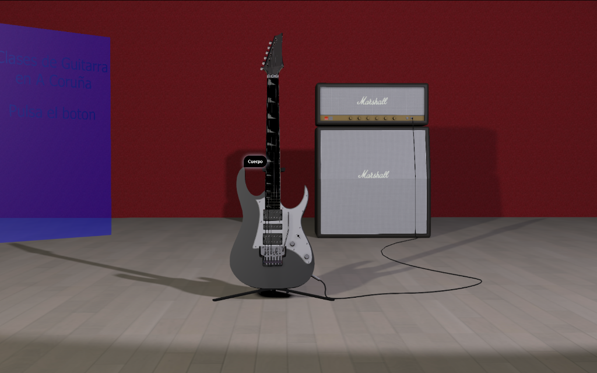

## Bienvenido a mi web

Aquí podrás encontrar algunos ejemplos de las tecnologías que he estado usando en los últimos tiempos. Esta web ha sido creada en Abril de 2017 y todavía no he podido recopilar trabajos que tengo por ahí almacenados en backups que aún no he revisado. De todas maneras es un inicio y intentaré recopilar más proyectos en el futuro. El código va a estar almacenado en [Github](https://github.com/MarcosCalvi) para que el que quiera echarle un ojo pueda.

### Terraform

Puedes verlo en el explorador en este [enlace](https://marcoscalvi.github.io/Terraform/)

El código del proyecto está alojado en [Github](https://github.com/MarcosCalvi/Terraform)

### Guitarra.- Presentación 3d

Puedes verlo en el explorador en este [enlace](https://marcoscalvi.github.io/GuitarPresentation/)

El código del proyecto está alojado en [Github](https://github.com/MarcosCalvi/GuitarPresentation)

## Quién soy...
Marcos Calviño, natural de A Coruña, Galicia, España. Mi principal actividad son las clases de guitarra eléctrica en mi ciudad. Las clases son una actividad que deja bastante tiempo libre que yo empleo en mi otra gran afición: la programación, que es de lo que se ocupa este sitio. 
En la informática empecé desde que aparecieron los primeros ordenadores personales, en concreto el ZX Spectrum 16k y más tarde el Spectrum 48+. En estos primitivos sistemas a lo que más me dedicaba era a los videojuegos, pero ya empezaba a teclear los programas que aparecian en papel en las revistas, Microhobby principalmente. Empece con el Basic que era el primer lenguaje para microordenadores pero ya se usaba también algo de código máquina (¡¡¡tecleado en hexadecimal dígito a dígito!!!). A los Spectrums los siguieron los Amstrad y los primeros pcs clónicos. Cuando acabe el instituto ingresé en la Facultad de Informática de A Coruña, en una época que no había ni un solo pc en la facultad y los examenes de programación se hacian en papel. Despues de dos años cambié a la escuela de Graduados Sociales de la UAC y la informática quedo a un lado hasta que me copmpre el primer Pc haya por 1996, era un Pentium 200MHz y el sistema Windows 95, ¡la de cuelgues que tenía ese sistema!. Hice un par de cursillos del Inem de introducción a Internet en el que ya empecé a programar alguna página en html y otro de Ofimática en el que empecé con las bases de datos y un poco de Visual Basic para programar basicamente aplicaciones de gestión de clientes. Al poco tiempo quede en paro y pase un año estudiando Java en la Academía PcCarrier, en esa época me pasaba lo menos 12 horas al día delante del ordenador entre las clases por la mañana y la programación en casa por la tarde y por la noche. Ese cursillo me introdujo en la programación orientada a objetos y la gestión de eventos de la interface de usuario, que en Java es un hueso. También la conexión entre máquinas por sockets fue otro de los temas más interesantes así como las bases de datos ODBC. Entre otras aplicaciones recuerdo un ajedrez para dos jugadores que estaba muy chulo, igual aún está por algún cd de backup de esa época, si es que se puede leer algo. Más adelante con el acceso a la red volvi a la programación web y me introduje en todos los temas de html, javascript y css así como el php y mySql para la programación en el servidor así cómo el manejo de servidores, sobre todo Apache. Desde el inicio de la era del pc también me introduje en todo lo que tenía que ver con la producción y edición de audio. (Midi, Cubase, Cakewalk, Logic Audio, Sound Forge...) Herramientas profesionales disponibles para trabajar en casa o en el estudio, un avance grandisimo para los músicos. También llegaron los primeros programas de 3d como 3dStudio o Autocad y más tarde Blender. Blender fue el que más me engancho al final y llevo desde el 2007 aproximadamente muy metido en estudiar todas las facetas del programa, que es inmenso: modelado, texturizado, UV mapping y sobre todo la programación de las físicas y los actuadores del entorno de juego que es lo que a mi realmente más me interesa. Además Blender también incluye las armaduras para las animaciones de los personajes y el entorno el renderizado y edición de animaciones y imagenes estáticas e incluso el audio tanto en el juego cómo en la edición de video, el programa es de lo más completo. También incluye shaders OpenGL que pueden ser programados directamente a la tarjeta de video, incrementando el rendimiento del juego el 100% y las físicas se manejan implementando la librería Bullet, muy extendida actualmente. Además me llevo a estudiar Python que es uno de los lenguajes que hoy en día es muy importante en el cloud computing y de ahí al cloud computing en si mismo y al control de versiones. (Heroku, Openshift Online, Google Apps, GitHub, Ssh, Ruby, servidores Linux...) La continuación del Blender ha sido el descubrimiento de Blend4Web, una librería javascript que basandose en Blender, en el que se hace el modelado, las escenas, etc.., permite presentar los proyectos directamente en todos los exploradores, está basada en WebGl para los gráficos y tiene sus propias físicas, la biblioteca Uranium basada en Bullet portado a javascript y es open source. Blen4Web ha sido utilizado incluso por la Nasa para su presentación del Rover de Marte y por algunas otras grandes empresas. En el terreno de los motores de juego además de Blender y Blend4Web conozco Unity, CryEngine y UnrealEngine de hecho mi próximo objetivo es meterme con el CryEngine o el Lumberyard para aprender a programar en Visual C++.
Un saludo y espero que encontreis los contenidos interesantes.

## Conocimientos informáticos

### Lenguajes de programación: 
Java, Python, Javascript, Html5, Css, Php
### Bases de datos relacionales
MySql, Sqlite, Access
### 3d
Blender, blend4web
### Edición de audio
Cubase, Nuendo, Audacity, SoundForge, herramientas de producción, vsts, instrumentos virtuales...

## Experiencia
- Programación web: varios sitios creados como freelance. Aplicaciones para uso privado para sistemas Windows y Android.
- Programación de videojuegos: varios prototipos de juegos principalmente FPS, manejo de físicas, desencadenadores, eventos, modelado y animación de personajes y niveles, armaduras, animaciones, generación de los escenarios programaticamente, etc. 
- Programación de aplicaciones: aplicaciones de gestión de base de datos con interfaz gráfica de usuario, Java, Sql, aplicaciones móviles Android, cloud computing, etc...
- Producción musical: grabación de audio y producción musical, varios discos publicados en más de 25 años de experiencia.  
